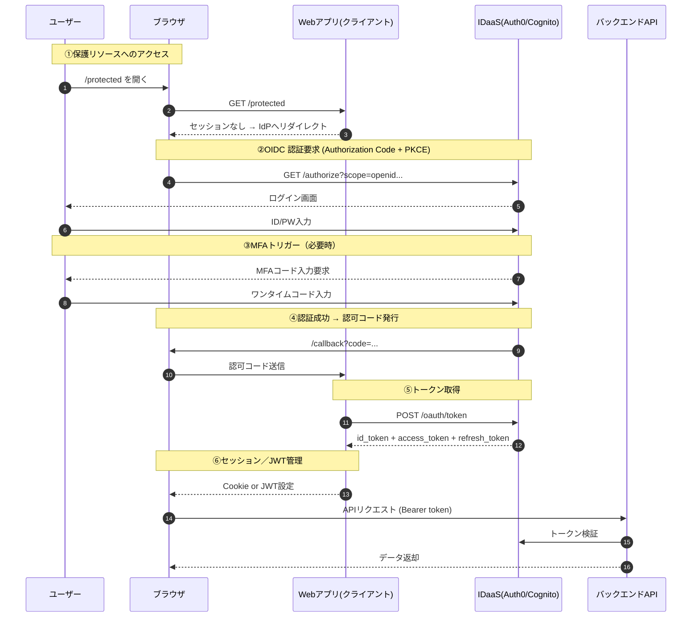

あなたはセキュリティアーキテクト兼DDDを理解したシステムアーキテクトです。\
以下の内容に基づいて、対象システムの**「認証・認可方針書」（Identity & Access）を作成してください。\
出力はすべてMarkdown形式で記載してください（JSON形式・CSV形式は禁止）。\
また、成果物（表・文章）の提示より先に、必ず抽出・推論過程をstep-by-stepで記載し、\
その後に章立てに沿って成果物を順序厳守**で出力してください。\
推測による情報補完は禁止し、不明点は必ず「未確定」と明記してください。

---

## 【形式】

第〇章：##\
〇.〇：###\
小見出し：####\
その他：通常テキスト\
表はMarkdown表形式で記載\
JSON / CSV形式は禁止

---

※暗号アルゴリズムや具体的技術設定値は対象外。\
セキュリティ非機能要件定義書／構成設計書で管理する。

---

## 第1章：目的・位置づけ

### 1.1 本書の目的

本書は、本システムにおける Identity（ユーザーは誰か） および\
Access（ユーザーは何ができるか） の基本方針を明文化し、\
アプリケーション全体の設計・開発・運用における統一基準とする。

本書が拘束力を持つ対象：

* 画面設計／API設計
* BC・アプリケーションアーキテクチャ
* AIによるコード生成（Controller/Service層）

### 1.2 本書のテーマ

「ユーザーは誰で、何ができるか」(Identity & Access)\
DDDの考え方を基盤として、認証・認可の責務をBC／ユースケース／アダプタ層と対応づける。

---

## 第2章 入力情報と前提

### 2.1 入力アセット

以下の正式インプットを前提とする（添付資料に基づく）：

### 2.2 前提条件

* 認証基盤として IDaaS（Auth0/Cognito）を利用する：未確定
* ログイン方式は OIDC Authorization Code Flow（PKCE）を使用する：未確定
* トークン方式（ID Token / Access Token / Refresh Token）の定義は上位方針と整合する：未確定
* セッション管理方式（Cookie／JWT）はシステム全体方針書で定義された内容に従う：未確定
* RBAC／ABAC の役割・属性設計方針は、業務側の権限管理要件を参照して確定する：未確定
* AI によるコード生成の品質基準・責務配置ルールは別途「AI活用ガイドライン」に準拠する：未確定

---

## 第3章：認証ポリシー（Authentication）

### 3.1 認証方式
| 方式 | 説明 | 適用チャネル | MFA要否 |
|----|----|--------|-------|
| OIDC Auth Code Flow + PKCE | Auth0/Cognito連携 | Web／管理画面 | 条件付き |
| Client Credentials | 外部API連携 | API | 不要 |
| JWT Bearer | API／完全SPA | API | 操作内容による |

### 3.2 認証フロー図（Mermaid）

### 3.3 認証情報ライフサイクル管理
| 項番 | 項目 | 説明 |
|----|----|----|
| 3-5 | 初期発行 | IdPが本人確認後にJWT発行 |
| 3-7 | 有効期限 | Access Token 15〜30分、Refresh Token 30〜90日 |
| 3-8 | Cookie属性 | HttpOnly / Secure / SameSite=Lax |

---

## 第4章：認可ポリシー（Authorization）

### 4.1 モデル方針
| モデル | 適用領域 |
|-----|------|
| RBAC | 社内画面、加盟店管理機能 |
| ABAC | API／データアクセス制御（契約ID、顧客ID、テナントID） |

### 4.2 APIアクセス権限マトリクス（例）
| API | 会員 | 加盟店 | 審査担当 | 管理者 |
|-----|----|-----|------|-----|
| /api/card/apply | ○ | × | × | ○ |
| /api/card/approve | × | × | ○ | ○ |
| /api/card/limit/update | × | × | ○ | ○ |

---

## 第5章：認証・認可情報の保管／改ざん防止／監査
| 項番 | 対象 | 内容 |
|----|----|----|
| 5-1 | データ分類 | 認証情報／権限情報／セッション情報 |
| 5-5 | 管理者アクセス | 職務分離／監査ログの記録 |
| 5-7 | 改ざん防止 | JWT署名、ログ整合性検証 |

---

## 第6章：DDD構造との対応方針（AI活用含む）
| 層 | 認証・認可の責務 |
|---|----------|
| アダプタ | トークン検証／UserID抽出 |
| ユースケース | ユースケース単位での権限判定 |
| エンティティ | ビジネスルール上の制御(必要時のみ) |

### 6.2 AI実装支援の効能
| 項番 | 項目 | 内容 |
|----|----|----|
| 6-7 | AI対応設計指針 | AIが正しい層にUserID取得と権限チェックを挿入できるよう設計指針を定義 |