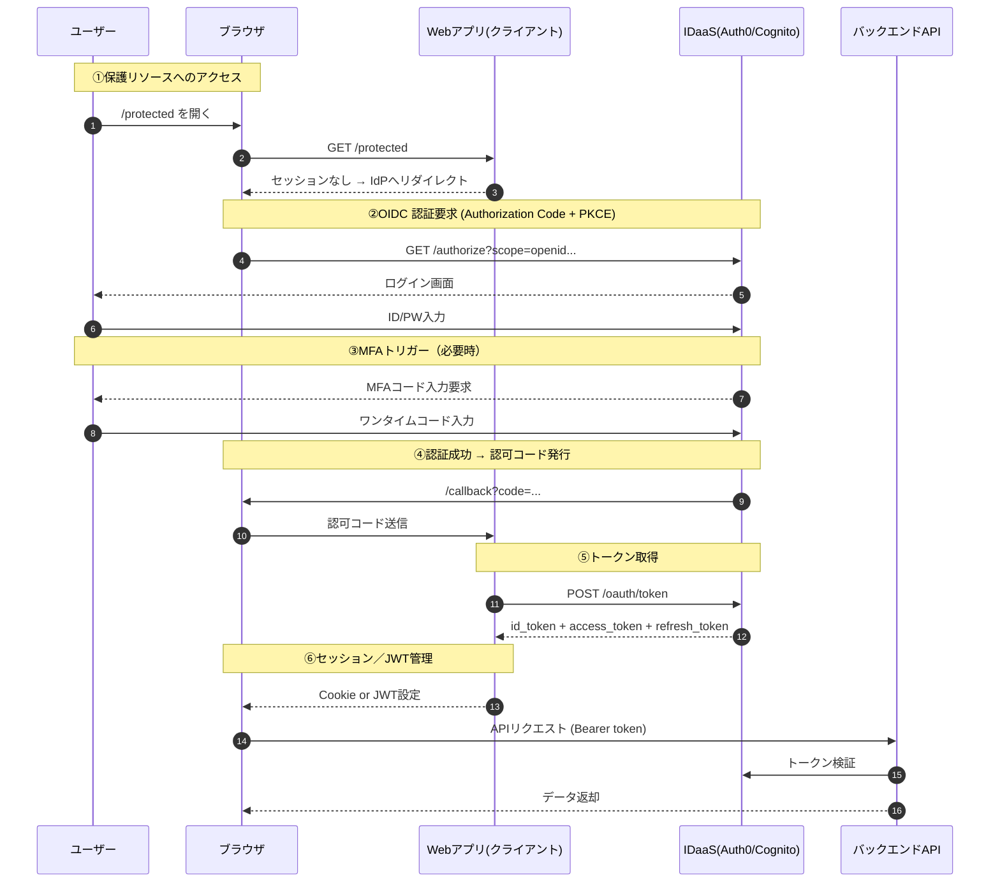

# 認証・認可方針書

| 項目 | 内容 |
|------|------|
| ドキュメントID | AUPZZZZ001 |
| 版数 | 1.1 |
| 作成日 | 2026-01-14 |
| 最終更新日 | 2026-01-15 |
| ステータス | ドラフト |

---

## 第1章 適用範囲

### 1.1 目的

本書は、本システムにおける Identity（ユーザーは誰か） および Access（ユーザーは何ができるか） の基本方針を明文化し、アプリケーション全体の設計・開発・運用における統一基準とする。

本書が拘束力を持つ対象：

- 画面設計／API設計
- BC・アプリケーションアーキテクチャ
- AIによるコード生成（Controller/Service層）

### 1.2 適用範囲

**表1 — 適用範囲**

| 項目 | 記述内容 |
|------|----------|
| 対象システム | ハウスクレジット基幹システム |
| 対象BC | ドメインスコープ定義書およびコンテキストマップに定義された全BC |
| 対象チャネル | Web画面、管理画面、API、バッチ |
| 除外対象 | 暗号アルゴリズム・技術設定値の詳細（セキュリティ非機能要件定義書で管理） |

### 1.3 本書のテーマ

「ユーザーは誰で、何ができるか」(Identity & Access)

DDDの考え方を基盤として、認証・認可の責務をBC／ユースケース／アダプタ層と対応づける。

### 1.4 技術スタック

本システムにおける認証・認可基盤の技術スタックは以下の通りとする。

**表1-2 — 技術スタック**

| レイヤー | 技術 | 用途 | 備考 |
|---------|------|------|------|
| IDaaS | Amazon Cognito / Auth0 | 認証基盤 | 選定中 |
| 認証プロトコル | OIDC + PKCE | 認証フロー | OAuth 2.0ベース |
| トークン形式 | JWT | アクセストークン | RS256署名 |
| 認可モデル | RBAC / ABAC | アクセス制御 | 用途により使い分け |

### 1.5 関連文書

**表2 — 関連文書一覧**

| 関連ドキュメント | 関係性 |
|------------------|--------|
| セキュリティ方針書 | 防御設計の上位方針を参照 |
| APIガバナンス方針書 | API層の認証・認可実装を参照 |
| ソフトウェアアーキテクチャ方針書 | レイヤ構成・責務配置を参照 |
| 非機能要件定義書 | 性能・可用性要件を参照 |

---

## 第2章 引用規格

本書は以下の規格・標準を参照する：

- RFC 6749 OAuth 2.0 Authorization Framework
- OpenID Connect Core 1.0
- NIST SP 800-63 Digital Identity Guidelines

---

## 第3章 用語及び定義

### 3.1 規範用語の定義

本書で使用する規範用語は RFC 2119 に準拠し、以下の意味で使用する。

**表2-2 — 規範用語定義**

| 用語 | 意味 |
|------|------|
| しなければならない（MUST） | この要件は絶対的に必須である。例外は認められない |
| してはならない（MUST NOT） | この行為は絶対的に禁止される。例外は認められない |
| すべきである（SHOULD） | 特別な理由がない限り、この要件に従うことが強く推奨される |
| すべきではない（SHOULD NOT） | 特別な理由がない限り、この行為を避けることが強く推奨される |
| してもよい（MAY） | この要件は任意であり、状況に応じて判断してよい |

### 3.2 ドメイン用語の定義

本書で使用する主要な用語を以下に定義する。

**表3 — 用語定義**

| 用語 | 定義 |
|------|------|
| 認証（Authentication） | ユーザーの身元を確認するプロセス |
| 認可（Authorization） | ユーザーに対するアクセス権限を制御するプロセス |
| OIDC | OpenID Connect。OAuth 2.0上に構築された認証レイヤ |
| PKCE | Proof Key for Code Exchange。認可コードフローのセキュリティ強化 |
| RBAC | Role-Based Access Control（ロールベースアクセス制御） |
| ABAC | Attribute-Based Access Control（属性ベースアクセス制御） |
| IDaaS | Identity as a Service。クラウドベースの認証基盤 |

---

## 第4章 認証ポリシー（Authentication）

### 4.1 認証方式

**表4 — 認証方式一覧**

| 方式 | 説明 | 適用チャネル | MFA要否 |
|------|------|--------------|---------|
| OIDC Auth Code Flow + PKCE | Auth0/Cognito連携 | Web／管理画面 | 条件付き |
| Client Credentials | 外部API連携 | API | 不要 |
| JWT Bearer | API／完全SPA | API | 操作内容による |

### 4.2 認証フロー

認証フローは以下の手順に従わなければならない：

1. 保護リソースへのアクセス時、セッションがない場合はIdPへリダイレクトしなければならない
2. OIDC認証要求（Authorization Code + PKCE）を発行しなければならない
3. MFAトリガー条件に該当する場合、MFAを要求しなければならない
4. 認証成功時、認可コードを発行しトークンを取得しなければならない
5. セッション／JWT管理を実施しなければならない
6. APIリクエスト時はBearerトークンを付与しなければならない

### 4.3 認証情報ライフサイクル管理

**表5 — 認証情報ライフサイクル**

| 項目 | 方針 |
|------|------|
| 初期発行 | IdPが本人確認後にJWT発行しなければならない |
| Access Token有効期限 | 15〜30分としなければならない |
| Refresh Token有効期限 | 30〜90日としなければならない |
| Cookie属性 | HttpOnly / Secure / SameSite=Lax を設定しなければならない |
| トークン失効 | ログアウト時・パスワード変更時に失効しなければならない |

---

## 第5章 認可ポリシー（Authorization）

### 5.1 モデル方針

**表6 — 認可モデル方針**

| モデル | 適用領域 |
|--------|----------|
| RBAC | 社内画面、加盟店管理機能 |
| ABAC | API／データアクセス制御（契約ID、顧客ID、テナントID） |

### 5.2 APIアクセス権限マトリクス

**表7 — APIアクセス権限マトリクス（例）**

| API | 会員 | 加盟店 | 審査担当 | 管理者 |
|-----|------|--------|----------|--------|
| /api/card/apply | ○ | × | × | ○ |
| /api/card/approve | × | × | ○ | ○ |
| /api/card/limit/update | × | × | ○ | ○ |
| /api/merchant/info | × | ○ | × | ○ |
| /api/admin/users | × | × | × | ○ |

### 5.3 認可判定の実装方針

**表8 — 認可判定実装方針**

| 項目 | 方針 |
|------|------|
| 判定タイミング | API Gateway または Controller でまず粗粒度判定、Service層で細粒度判定を行わなければならない |
| ロール管理 | IDaaS または 自システムのロール管理機能で一元管理しなければならない |
| 属性取得 | トークンクレームまたはDBから取得しなければならない |
| キャッシュ | 権限情報は適切にキャッシュしてもよい（TTL設定必須） |

---

## 第6章 認証・認可情報の保管／改ざん防止／監査

### 6.1 認証・認可情報管理方針

**表9 — 認証・認可情報管理方針**

| 項目 | 方針 |
|------|------|
| データ分類 | 認証情報／権限情報／セッション情報に分類しなければならない |
| 保管場所 | 認証情報はIDaaS、権限情報は自システムDBで管理しなければならない |
| 暗号化 | 保存時・転送時ともに暗号化しなければならない |
| 管理者アクセス | 職務分離を徹底し、監査ログを記録しなければならない |
| 改ざん防止 | JWT署名、ログ整合性検証を実施しなければならない |

---

## 第7章 DDD構造との対応方針

### 7.1 レイヤ別責務

**表10 — レイヤ別認証・認可責務**

| 層 | 認証・認可の責務 |
|----|------------------|
| 外部フレームワークとドライバー | 認証トークンの受信・初期検証を行う |
| アダプタ層 | トークン検証／UserID抽出を行わなければならない |
| ユースケース層 | ユースケース単位での権限判定を行わなければならない |
| エンティティ層 | ビジネスルール上の制御（必要時のみ）を行ってもよい |

### 7.2 AI実装支援の指針

**表11 — AI実装支援指針**

| 項目 | 内容 |
|------|------|
| AI対応設計指針 | AIが正しい層にUserID取得と権限チェックを挿入できるよう設計指針を定義しなければならない |
| コード生成ルール | Controller層でトークン検証、Service層で権限判定のパターンを標準化しなければならない |
| テンプレート | 認証・認可処理のコードテンプレートを提供することが望ましい |

---

## 第8章 セッション管理方針

### 8.1 セッション管理方針

**表12 — セッション管理方針**

| 項目 | 方針 |
|------|------|
| セッションID生成 | 暗号論的に安全な乱数で生成しなければならない |
| セッション固定化対策 | ログイン成功時にセッションIDを再生成しなければならない |
| タイムアウト | アイドルタイムアウト30分、絶対タイムアウト8時間を基本とする |
| 同時ログイン | 同一ユーザーの同時ログイン制御方針は未確定 |
| ログアウト | サーバー側セッション無効化とトークン失効を実施しなければならない |

---

## 第9章 MFA（多要素認証）方針

### 9.1 MFA方針

**表13 — MFA方針**

| 項目 | 方針 |
|------|------|
| 適用対象 | 管理者操作、高額取引、リスク検知時に適用しなければならない |
| 認証要素 | TOTP（ワンタイムパスワード）を基本とする |
| バックアップ | リカバリーコードを提供しなければならない |
| 強制有無 | 管理者ロールはMFA必須としなければならない |

---

## 付録A 未確定事項一覧

本方針書において「未確定」と記載された事項を以下にまとめる。これらは後続の検討・合意形成により確定させなければならない。

**表A.1 — 未確定事項一覧**

| 章節 | 項目 | 備考 |
|------|------|------|
| 4.2 | 認証基盤の選定（Auth0/Cognito） | IDaaS製品の選定が必要 |
| 4.2 | ログイン方式（OIDC Auth Code Flow + PKCE） | 技術選定が必要 |
| 4.2 | トークン方式の定義 | 上位方針との整合確認が必要 |
| 4.2 | セッション管理方式（Cookie／JWT） | システム全体方針との整合が必要 |
| 4.2 | RBAC／ABACの役割・属性設計 | 業務側の権限管理要件を参照 |
| 4.2 | AI活用ガイドラインとの整合 | ガイドライン策定が必要 |
| 9 | 同一ユーザーの同時ログイン制御方針 | 業務要件の確認が必要 |

---

## 付録B 検討が必要な論点

以下は、本方針書の運用にあたり検討が必要な論点である。

1. **IDaaS製品の選定**
   - Auth0とCognitoの比較検討
   - コスト、機能、運用負荷の観点での評価

2. **ロール体系の設計**
   - 業務役割とシステムロールのマッピング
   - 階層的ロール構造の要否

3. **属性ベースアクセス制御（ABAC）の詳細設計**
   - 判定に使用する属性の洗い出し
   - ポリシー定義言語の選定

4. **外部システム連携時の認証方式**
   - 銀行口座振替API、外部信用情報機関との連携
   - Mutual TLS、API Keyの使い分け

5. **監査ログの詳細設計**
   - 記録すべきイベントの洗い出し
   - 保管期間、アクセス制御

---

## 改版履歴

| 版数 | 日付 | 変更内容 | 作成者 |
|------|------|---------|--------|
| 1.0 | 2026-01-14 | 初版作成 | - |
| 1.1 | 2026-01-15 | 規範用語定義追加、技術スタック追加、章番号整合性修正 | - |
